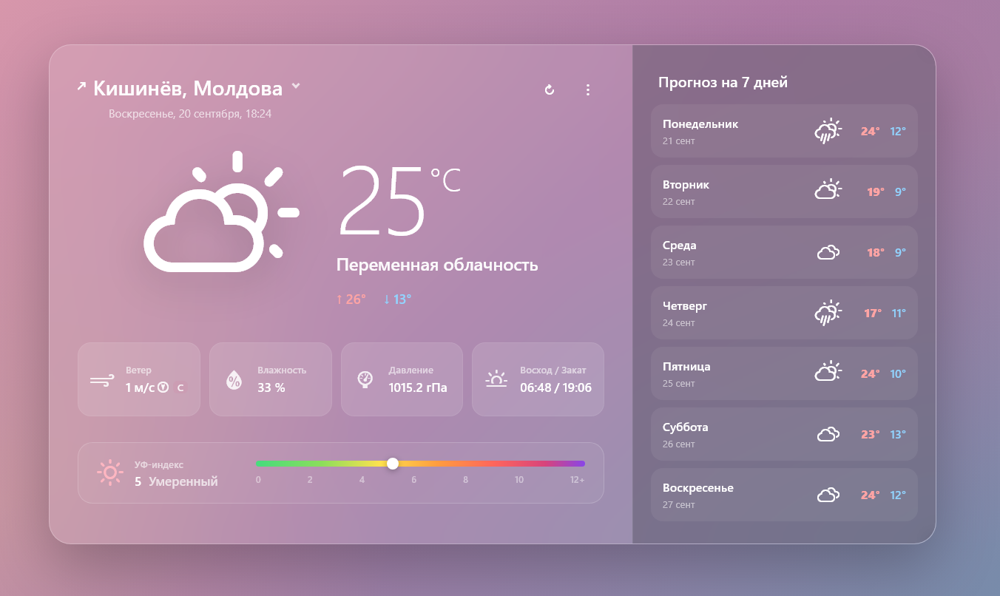

# 🌤️ Weather Widget

A polished, framework-free weather widget built with vanilla JavaScript. Shows current conditions, a 7‑day forecast, wind direction, UV index, and handles loading and error states - all from a single self-contained frontend, no build step required.




**[▶ Live Demo](https://siradastra.github.io/weather-widget/)**

## ✨ Features

- Current weather for the user's geolocated position
- 7-day forecast
- Wind speed & direction indicator
- UV index with a visual severity scale
- Humidity, pressure, sunrise/sunset
- Manual refresh
- Skeleton loading state and a dismissible error banner
- Fallback to a default location if geolocation is denied or unavailable, ⊣for testing purposes⊢
- Fully responsive layout (desktop → tablet → mobile)
- Semantic HTML and basic accessibility support

## 🛠️ Tech Stack

- **Vanilla JavaScript (ES2022+)** - ES modules, `async/await`
- **CSS3** - CSS Grid, backdrop-filter (glassmorphism), responsive breakpoints
- **[Weather Icons](https://erikflowers.github.io/weather-icons/)** by Erik Flowers - icon font (font: SIL OFL 1.1, CSS: MIT)

## 🌐 APIs Used

| Purpose | Provider | Auth |
|---|---|---|
| Weather data | [Open-Meteo](https://open-meteo.com/) | None (free, no API key) |
| Reverse geocoding (coordinates → city name) | [BigDataCloud](https://www.bigdatacloud.com/) | None (free client-side endpoint) |

## 📁 Project Structure

```
weather-widget/
├── index.html
├── css/
│   ├── style.css              # widget layout & theme
│   ├── weather-icons.min.css  # icon font
│   └── weather-icons-wind.min.css
├── scripts/
│   ├── script.js               # app logic
│   └── weather-data.js         # weather-code → icon/description mapping
└── font/                       # weather-icons webfont files
```

## 🚀 Getting Started

This project has no build step - it's plain HTML/CSS/JS. However, because `script.js` is loaded as an **ES module**, opening `index.html` directly via `file://` will be blocked by the browser's CORS policy. Serve it from a local static server instead:

```bash
# clone the repo
git clone https://github.com/<your-username>/weather-widget.git
cd weather-widget

# serve it locally (pick one)
npx serve .
# or
python -m http.server 8080
```

Then open `http://localhost:<port>` in your browser. Allow location access when prompted, or let it fall back to the default location.

> **Note:** Geolocation requires a secure context (`https://` or `localhost`) in most browsers.

## 🗺️ Roadmap / TODO

- [ ] Manual city search (in addition to geolocation)
- [ ] Settings menu: language toggle (RU/EN - descriptions are already bilingual in `weather-data.js`, just not wired to a UI switch yet)
- [ ] Settings menu: unit toggle (°C/°F, m/s / km/h)
- [ ] IP-based geolocation fallback when GPS/browser geolocation is unavailable or denied
- [ ] Retry with backoff on transient network failures
- [ ] Request timeouts (`AbortController`) for fetch and geolocation calls
- [ ] Split `script.js` into smaller modules (api / render / state / handlers)
- [ ] Move the color palette into CSS custom properties
- [ ] Basic unit tests for pure helpers (`getWindDetails`, `getUVDetails`, `transformWeatherData`)

## 🙏 Credits

- Weather data by [Open-Meteo](https://open-meteo.com/)
- Reverse geocoding by [BigDataCloud](https://www.bigdatacloud.com/)
- Icons: [Weather Icons](https://erikflowers.github.io/weather-icons/) by Erik Flowers - font under [SIL OFL 1.1](http://scripts.sil.org/OFL), CSS under MIT

## 📄 License

This project is licensed under the MIT License - see the [LICENSE](LICENSE) file for details.

## 👤 Author

**Alexandr Cojuhari**
[GitHub](https://github.com/SirAdAstra)
[LinkedIn](www.linkedin.com/in/siradastra) 
